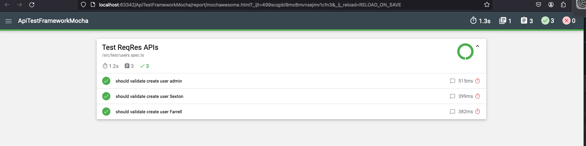

[](https://github.com/jonathan-gartland/ApiTestFrameworkMocha/actions/workflows/main.yml)  
  
# Automation Framework for API Testing  
A simple implementation of API tests using the following libraries:    
  
 
 
 
 
 
  
  
For the work I used either of the following:  
  
 
  


## Try it out:  
```bash
1. git clone https://github.com/jonathan-gartland/ApiTestFrameworkMocha.git
2. cd ApiTestFrameworkMocha
3. npm i
4. npm run test
```

## Folder structure:
```
├── Dockerfile
├── README.md
├── package-lock.json
├── package.json
├── src
│   ├── config
│   ├── helper
│   ├── resources
│   ├── schema
│   ├── services
│   ├── static
│   ├── test
│   ├── types
│   └── validations
└── tsconfig.json
```


## Test Results:  
  
  
